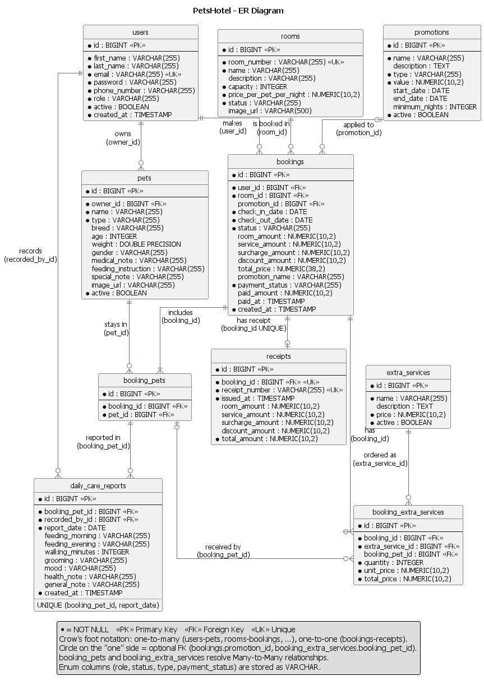
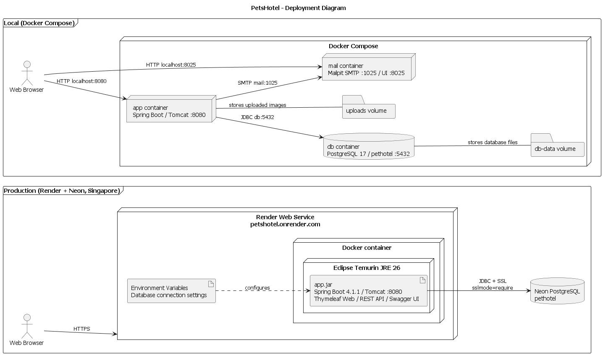

# PetsHotel — ระบบจัดการโรงแรมรับฝากสัตว์เลี้ยง

เว็บแอปพลิเคชันสำหรับจองห้องพักสัตว์เลี้ยง ลูกค้าค้นหาห้องว่าง จองห้อง เลือกบริการเสริม และดูรายงานการดูแลสัตว์รายวันได้ ส่วนพนักงานและผู้ดูแลระบบใช้จัดการห้อง การจอง การเช็คอิน/เช็คเอาท์ โปรโมชัน และรายงานได้

รายวิชา CP353002 Software Design and Development

**Live demo:** https://petshotel.onrender.com
(ใช้ Render แบบฟรี ถ้าไม่มีคนเข้า 15 นาที server จะหลับ ครั้งแรกที่เปิดอาจต้องรอประมาณ 1 นาที)

## สมาชิก

| ลำดับ | ชื่อ | รหัสนักศึกษา | Section | Branch | หน้าที่ |
| :---: | :--- | :---: | :---: | :--- | :--- |
| 1 | นายกิตติธัช คำโท | 673380029-0 | sec 1 | `kittithat_673380029-0_01` | Room & Admin, User, Notification (Observer), Security, Docker / Deploy, Flyway |
| 2 | นายธนัช พนมเริงไชย | 673380041-0 | sec 1 | `tanut_673380041-0_01` | Availability & Room Search |
| 3 | นางสาวรติมา สวัสดิ์นที | 673380055-9 | sec 1 | `ratima_673380055-9_01` | Pet & Daily Care Report |
| 4 | นางสาวกิติญาดา กองคำ | 673380509-6 | sec 1 | `kitiyada_673380509-6_01` | Booking & State Pattern |
| 5 | นางสาวนาเดีย คิดอ่าน | 673380513-5 | sec 1 | `nadia_673380513-5_01` | Pricing (Strategy), Promotion, Extra Service, Dashboard |

## Tech Stack

| ส่วน | เทคโนโลยี |
| :--- | :--- |
| Language | Java 26 |
| Framework | Spring Boot 4.1.1 (Web MVC, Data JPA, Security, Validation, Mail) |
| View | Thymeleaf |
| Database | PostgreSQL |
| Migration | Flyway |
| API Docs | springdoc-openapi (Swagger UI) |
| Testing | JUnit 5, Mockito, Spring Boot Test, JaCoCo |
| Build | Maven (Maven Wrapper) |
| Container | Docker, Docker Compose |
| Deployment | Render (web service) + Neon (PostgreSQL) |

## Architecture

ระบบใช้ **Layered Architecture**

```
Controller (Web / REST)  →  Service  →  Repository  →  Database
        ↑                      ↑
       DTO  ←── Mapper ──→  Entity
```

- **Controller** รับ request แยกเป็น `controller/web` (หน้าเว็บ Thymeleaf) และ `controller/api` (REST API)
- **Service** เก็บ business logic เรียกผ่าน interface
- **Repository** ใช้ Spring Data JPA
- **DTO + Mapper** แยกข้อมูลที่รับ/ส่งออกจาก Entity

Design Patterns ที่ใช้

| Pattern | ใช้ที่ |
| :--- | :--- |
| State | สถานะการจอง (PENDING → CONFIRMED → CHECKED_IN → CHECKED_OUT / CANCELLED) |
| Strategy | การคำนวณราคา (ค่าห้อง, บริการเสริม, ส่วนเพิ่ม, ส่วนลด) |
| Observer | ส่งอีเมลยืนยันเมื่อการจองได้รับการยืนยัน (`BookingConfirmedEvent`) |

รายละเอียดอยู่ใน [doc/design-patterns.md](doc/design-patterns.md) และ [doc/solid-analysis](doc/solid-analysis)

## Project Structure

```
PetsHotel_Project/
├── code/                      # Spring Boot project
│   ├── src/main/java/com/example/petshotel/
│   │   ├── config/            # Security, Swagger, Web config
│   │   ├── controller/api     # REST controllers
│   │   ├── controller/web     # Web (Thymeleaf) controllers
│   │   ├── domain/            # Entities และ Enums
│   │   ├── dto/               # Request / Response DTO
│   │   ├── exception/         # Custom exceptions และ handler
│   │   ├── mapper/            # Entity ↔ DTO
│   │   ├── notification/      # Observer: event, listener, email
│   │   ├── pricing/           # Strategy: การคำนวณราคา
│   │   ├── repository/        # Spring Data JPA
│   │   ├── service/           # Business logic
│   │   └── state/             # State: สถานะการจอง
│   ├── src/main/resources/
│   │   ├── db/migration/      # Flyway (V1 สร้างตาราง, V2 ข้อมูลตัวอย่าง)
│   │   ├── templates/         # Thymeleaf
│   │   └── static/            # CSS, JS, รูปภาพ
│   ├── Dockerfile
│   └── docker-compose.yml
├── doc/                       # เอกสาร (diagram, data dictionary, SOLID, use case)
├── img/                       # รูป diagram และหลักฐานผลการทดสอบ
└── test/                      # Test report และ coverage report
```

## Database (ER Diagram)



มีทั้งหมด 10 ตาราง: `users`, `pets`, `rooms`, `bookings`, `booking_pets`, `extra_services`, `booking_extra_services`, `promotions`, `receipts`, `daily_care_reports`

คำอธิบายแต่ละคอลัมน์อยู่ใน [doc/data-dictionary](doc/data-dictionary)

ตารางสร้างด้วย Flyway จาก `code/src/main/resources/db/migration` (Hibernate ตั้งเป็น `ddl-auto=validate` ตรวจอย่างเดียว ไม่สร้างตารางเอง)

## Installation / How to Run

### วิธีที่ 1: Docker (แนะนำ)

ต้องมี Docker Desktop

```bash
cd code
docker compose up --build
```

| URL | ใช้ทำอะไร |
| :--- | :--- |
| http://localhost:8080 | เว็บ PetsHotel |
| http://localhost:8080/swagger-ui.html | Swagger UI |
| http://localhost:8025 | Mailpit (ดูอีเมลที่ระบบส่ง) |

หยุดระบบ: `docker compose down` (ถ้าต้องการลบข้อมูลใน database ด้วย ใช้ `docker compose down -v`)

### วิธีที่ 2: รันบนเครื่อง

ต้องมี JDK 26 และ PostgreSQL

1. สร้าง database ชื่อ `pethotel`
2. ตั้งรหัสผ่าน database ผ่าน environment variable

   Windows (cmd)
   ```bat
   set "SPRING_DATASOURCE_PASSWORD=รหัสผ่าน PostgreSQL ของคุณ"
   ```
   macOS / Linux
   ```bash
   export SPRING_DATASOURCE_PASSWORD=รหัสผ่าน PostgreSQL ของคุณ
   ```
3. รันโปรแกรม (Flyway จะสร้างตารางและใส่ข้อมูลตัวอย่างให้อัตโนมัติ)
   ```bash
   cd code
   ./mvnw spring-boot:run
   ```
   Windows ใช้ `mvnw.cmd spring-boot:run`
4. เปิด http://localhost:8080

### บัญชีทดสอบ (local / Docker)

| Role | Email | Password |
| :--- | :--- | :--- |
| ADMIN | admin@petshotel.test | PetsHotel@2026 |
| STAFF | staff@petshotel.test | PetsHotel@2026 |

บัญชีลูกค้า (CUSTOMER) สมัครเองได้ที่หน้า Register

บน Live demo ใช้รหัสผ่านคนละชุดกับข้างบน

## API Documentation

เปิด Swagger UI ที่ `/swagger-ui.html` (เช่น http://localhost:8080/swagger-ui.html)

| Resource | Base path |
| :--- | :--- |
| Rooms | `/api/rooms` |
| Room availability / search | `/api/rooms/...` |
| Bookings | `/api/bookings` |
| Pets | `/api/owners/{ownerId}/pets` |
| Daily care reports | `/api/care-reports` |
| Extra services | `/api/extra-services` |
| Promotions | `/api/promotions` |

API ส่วนใหญ่ต้อง login ก่อน และ request ที่แก้ข้อมูล (POST / PUT / PATCH / DELETE) ต้องแนบ CSRF token (Swagger UI แนบให้อัตโนมัติ)

## Testing

```bash
cd code
./mvnw test
```

Repository test ใช้ PostgreSQL จริง ต้องตั้ง `TEST_DB_PASSWORD` ก่อนรัน

| รายการ | ผล |
| :--- | :---: |
| Tests ทั้งหมด | 460 (ผ่านทั้งหมด) |
| Line coverage | 84.8% |
| Branch coverage | 71.2% |

รายละเอียดและวิธีสร้างรายงานใหม่อยู่ใน [test/README.md](test/README.md)

## Deployment

| ส่วน | บริการ |
| :--- | :--- |
| Web application | Render (Docker, build จาก `code/Dockerfile`) |
| Database | Neon PostgreSQL (Singapore) |

ค่าที่เป็นความลับ (รหัสผ่าน database, remember-me key, hash รหัสผ่านบัญชีเดโม) ตั้งเป็น environment variable บน Render ไม่ได้เก็บใน repository



## เอกสารประกอบ

| เอกสาร | ที่อยู่ |
| :--- | :--- |
| Use Case Diagram | [img/diagrams/use-case.png](img/diagrams/use-case.png) |
| Use Case Description | [doc/use-case-description.md](doc/use-case-description.md) |
| Domain Model | [img/diagrams/domain-model.png](img/diagrams/domain-model.png) |
| Class Diagram | [img/diagrams/class-diagram.png](img/diagrams/class-diagram.png) |
| Sequence Diagrams | [ค้นหาห้อง](img/diagrams/sequence-search-room.png), [สร้างการจอง](img/diagrams/sequence-create-booking.png), [Check-out](img/diagrams/sequence-checkout.png), [Daily Care](img/diagrams/sequence-daily-care.png) |
| Activity Diagram | [img/diagrams/activity-booking.png](img/diagrams/activity-booking.png) |
| State Diagram | [img/diagrams/state-booking.png](img/diagrams/state-booking.png) |
| Component Diagram | [img/diagrams/component-diagram.png](img/diagrams/component-diagram.png) |
| Data Dictionary | [doc/data-dictionary](doc/data-dictionary) |
| Design Patterns | [doc/design-patterns.md](doc/design-patterns.md) |
| SOLID Analysis | [doc/solid-analysis](doc/solid-analysis) |
| Diagram source (PlantUML) | [doc/diagrams](doc/diagrams) |
| Slides | [doc/slide](doc/slide) |