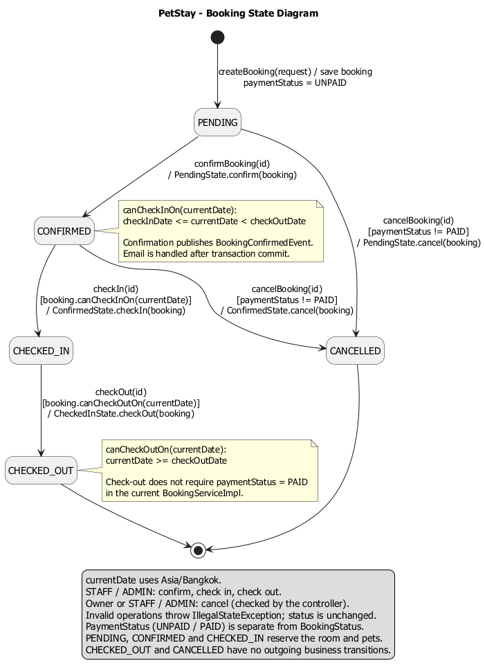
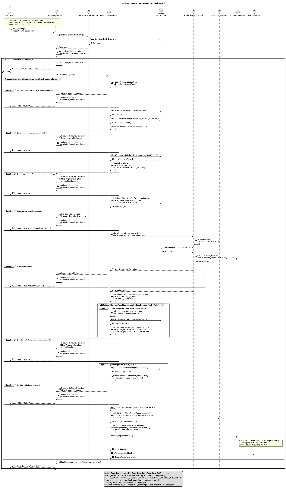
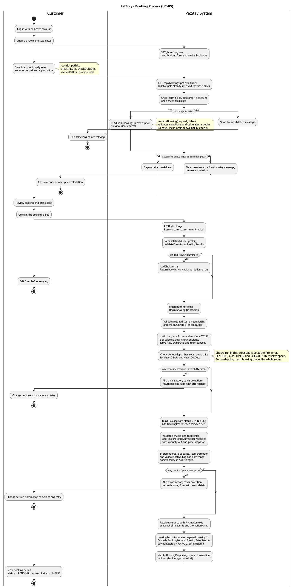

# คู่มือ Diagram ส่วนการจอง — กิตติญาดา

ทำต่อได้โดยไม่ต้องรอเพื่อน: ใช้ชื่อ Entity จาก Domain Model ที่มีอยู่ และตรวจชื่อคลาส เมธอด ตัวแปร กับโค้ดปัจจุบันโดยตรง ส่วน Sequence ไม่จำเป็นต้องรอไฟล์ Class Diagram เมื่อคลาสในโค้ดมีแล้ว

## 1. เริ่มจาก State Diagram

เปิด [`state-booking.puml`](diagrams/state-booking.puml) แล้วอ่านสถานะตามเส้นทางนี้:

`PENDING → CONFIRMED → CHECKED_IN → CHECKED_OUT`

มีทางแยกจาก `PENDING` และ `CONFIRMED` ไป `CANCELLED` เมื่อ `paymentStatus != PAID`

- ใช้ชื่อสถานะจาก `BookingStatus.java` ครบทั้ง 5 ค่า
- ลูกศรระบุเมธอดของ `BookingServiceImpl` และคลาส State ที่เปลี่ยนสถานะจริง
- เช็กอิน: `checkInDate <= currentDate < checkOutDate`
- เช็กเอาต์: `currentDate >= checkOutDate`
- `currentDate` ใช้เขตเวลา `Asia/Bangkok`
- การยกเลิกต้องผ่านการตรวจเจ้าของหรือสิทธิ์พนักงาน/ผู้ดูแล และห้ามยกเลิกเมื่อชำระเงินแล้ว
- `PaymentStatus` เป็นข้อมูลคนละตัวกับ `BookingStatus` โค้ดปัจจุบันไม่ได้บังคับว่าต้องชำระเงินก่อนเช็กเอาต์
- `CHECKED_OUT` และ `CANCELLED` จบวงจรสถานะ แต่ข้อมูลการจองยังคงอยู่ในฐานข้อมูล

รูปที่สร้างแล้ว:



## 2. ต่อด้วย Sequence สร้างการจอง

เปิด [`sequence-create-booking.puml`](diagrams/sequence-create-booking.puml) อ่านจากบนลงล่าง ภาพนี้แสดงเส้นทางเว็บ `POST /bookings` หลังลูกค้ากรอกฟอร์มแล้ว

1. `BookingController` เรียก `CurrentUserServiceImpl.getByEmail(principal.getName())`
2. กำหนด `form.setUserId(user.getId())` จากบัญชีที่ล็อกอิน แล้วตรวจฟอร์ม
3. เรียก `BookingServiceImpl.createBooking(form)` และ `prepareBooking(request, true)`
4. ตรวจข้อมูล โหลด User ล็อก Room และ Pet ตรวจสถานะห้อง เจ้าของสัตว์ ความพร้อมใช้ และความจุ
5. ตรวจสัตว์ที่จองซ้อนก่อน แล้วเรียก `AvailabilityServiceImpl.checkRoomAvailable(...)`
6. สร้าง Booking และ BookingPet ตรวจบริการเสริม แล้วตรวจโปรโมชันถ้ามี
7. เรียก `PricingServiceImpl.calculate(PricingContext)` และบันทึกราคาทุกส่วน ณ เวลาจอง
8. `BookingRepository.save(...)` บันทึก Booking พร้อม BookingPet และ BookingExtraService ผ่าน cascade
9. `BookingMapper.toResponse(...)` สร้างผลลัพธ์ แล้วกลับไปหน้ารายละเอียด `/bookings/{id}` หลัง transaction สำเร็จ

อ่านกรอบ `alt` เป็นทางเลือก, `opt` เป็นขั้นตอนที่มีเมื่อเลือกโปรโมชัน, `loop` เป็นการวนบริการ และ `break` เป็นข้อผิดพลาดที่หยุดเส้นทางที่เหลือ กรณีผิดพลาด Controller โหลดตัวเลือกกลับมาและแสดงฟอร์มพร้อมข้อความผิดพลาด

เพื่อให้ภาพอ่านง่าย รวม `UserRepository`, `RoomRepository`, `PetRepository`, `BookingPetRepository`, `ExtraServiceRepository` และ `PromotionRepository` ไว้ใน lifeline ชื่อ **Lookup Repositories** ซึ่งเป็นกลุ่มในภาพ ไม่ใช่คลาสใหม่ เมธอดบนลูกศรใช้ชื่อตัวแปร repository จริง ส่วน `BookingRepository` แสดงแยกเพื่อให้เห็นการตรวจห้องและจุดบันทึกชัดเจน

รูปที่สร้างแล้ว:



## 3. จบด้วย Activity กระบวนการจอง

เปิด [`activity-booking.puml`](diagrams/activity-booking.puml) ภาพนี้แสดงการจองหนึ่งครั้ง ตั้งแต่เลือกห้องจนได้รายการสถานะ `PENDING` ใช้สองช่องแบ่งหน้าที่ระหว่าง Customer และ PetStay System

- ก่อนส่งฟอร์ม ระบบปิดสัตว์ที่ติดจอง และคำนวณราคา preview
- หน้าเว็บต้องมีผลราคาสำเร็จที่ตรงกับข้อมูลปัจจุบัน จึงส่งฟอร์มหลังลูกค้ายืนยันใน dialog ได้
- Preview ใช้ `prepareBooking(request, false)` จึงไม่บันทึก ไม่ล็อกข้อมูล และไม่ทำการตรวจห้อง/สัตว์ซ้อนขั้นสุดท้าย
- ตอนสร้างจริงใช้ `prepareBooking(request, true)` ตรวจซ้ำก่อนบันทึก เพราะข้อมูลห้องว่างอาจเปลี่ยนระหว่างกรอกฟอร์ม
- ทางแยกเมื่อข้อมูลผิด ห้องไม่ว่าง สัตว์จองซ้อน หรือบริการ/โปรโมชันใช้ไม่ได้ จะคืนฟอร์มพร้อมข้อผิดพลาด ลูกค้าสามารถแก้แล้วเริ่มการจองใหม่ได้
- หลังบันทึกสำเร็จได้ `status = PENDING` และ `paymentStatus = UNPAID` การยืนยัน เช็กอิน เช็กเอาต์ และยกเลิกอยู่ใน State Diagram

รูปที่สร้างแล้ว:



## ชื่อตัวแปรที่ตรวจเทียบกับโค้ดแล้ว

| ชื่อ | ชนิด / ความหมาย | แหล่งอ้างอิง |
|---|---|---|
| `userId` | `Long` — Controller กำหนดจากผู้ใช้ที่ล็อกอิน ไม่รับจากฟอร์ม | `CreateBookingRequest`, `BookingController` |
| `roomId` | `Long` — ห้องที่เลือก | `CreateBookingRequest` |
| `petIds` | `List<Long>` — สัตว์ที่เข้าพัก ต้องไม่ซ้ำและเป็นของผู้จอง | `CreateBookingRequest`, `validateCreateRequest()`, `validatePets()` |
| `checkInDate`, `checkOutDate` | `LocalDate` — วันออกต้องหลังวันเข้า | `CreateBookingRequest`, `Booking` |
| `servicePetIds` | `Map<Long, List<Long>>` — key คือ serviceId, value คือ petIds ที่รับบริการ | `CreateBookingRequest`, `addSelectedServices()` |
| `promotionId` | `Long` — ไม่บังคับเลือก | `CreateBookingRequest` |
| `bookingPets`, `extraServices` | รายการ BookingPet และ BookingExtraService ที่บันทึกผ่าน cascade | `Booking` |
| `bookingPetsByPetId` | `Map<Long, BookingPet>` — ใช้ผูกบริการกับสัตว์ในการจอง | `BookingServiceImpl.prepareBooking()` |
| `roomAmount`, `serviceAmount`, `surchargeAmount`, `discountAmount`, `totalPrice` | `BigDecimal` — ราคาที่เก็บใน Booking | `Booking`, `BookingServiceImpl.prepareBooking()` |
| `promotionName` | `String` — เก็บชื่อโปรโมชัน ณ เวลาจอง | `Booking` |
| `status`, `paymentStatus` | `BookingStatus`, `PaymentStatus` — สถานะการจองและการชำระเงิน | `Booking` |
| `PET_RESERVING_STATUSES`, `ACTIVE_STATUSES` | `PENDING`, `CONFIRMED`, `CHECKED_IN` — สถานะที่นับว่าครองห้อง/สัตว์ | `BookingServiceImpl`, `AvailabilityServiceImpl` |

ไฟล์โค้ดสำหรับตรวจต่อ:

- [BookingStatus.java](../code/src/main/java/com/example/petshotel/domain/enums/BookingStatus.java)
- [Booking.java](../code/src/main/java/com/example/petshotel/domain/entity/Booking.java)
- [BookingPet.java](../code/src/main/java/com/example/petshotel/domain/entity/BookingPet.java)
- [CreateBookingRequest.java](../code/src/main/java/com/example/petshotel/dto/request/CreateBookingRequest.java)
- [BookingController.java](../code/src/main/java/com/example/petshotel/controller/web/BookingController.java)
- [BookingRestController.java](../code/src/main/java/com/example/petshotel/controller/api/BookingRestController.java)
- [BookingServiceImpl.java](../code/src/main/java/com/example/petshotel/service/impl/BookingServiceImpl.java)
- [AvailabilityServiceImpl.java](../code/src/main/java/com/example/petshotel/service/impl/AvailabilityServiceImpl.java)
- [booking-form.js](../code/src/main/resources/static/js/booking-form.js)
- [State implementations](../code/src/main/java/com/example/petshotel/state)

## แก้ .puml แล้วสร้างรูปใหม่

โครงสร้างเหมือนของเพื่อน: ต้นฉบับอยู่ใน `doc/diagrams/` และ PNG อยู่ใน `img/diagrams/` โดยชื่อไฟล์ตรงกัน

เปิด PowerShell ที่โฟลเดอร์โปรเจกต์ชั้นในซึ่งมี `README.md`, `code`, `doc`, `img` แล้วรัน:

```powershell
.\doc\diagrams\render-booking-diagrams.ps1
```

สคริปต์ตรวจไวยากรณ์ก่อน แล้วสร้าง PNG ใหม่เฉพาะสามไฟล์ส่วนการจอง รองรับ Java ที่อยู่ใน PATH, `JAVA_HOME` หรือ `.jdks` ภายในโฟลเดอร์ผู้ใช้ และเพิ่มขนาดสูงสุดของภาพเพื่อป้องกันภาพยาวถูกตัด

ครั้งนี้ใช้ PlantUML 1.2025.2 ที่ดาวน์โหลดไว้ในโฟลเดอร์ชั่วคราว หากไฟล์ชั่วคราวถูกล้าง ให้ระบุ jar ที่มีอยู่ในเครื่อง:

```powershell
.\doc\diagrams\render-booking-diagrams.ps1 -PlantUmlJar 'C:\path\to\plantuml.jar'
```

หากหา Java ไม่พบ สามารถเพิ่ม `-JavaExecutable 'C:\path\to\java.exe'` ได้

## ใส่รูปในเอกสารเหมือนเพื่อน

หากเอกสาร Markdown อยู่ใน `doc/` ใช้รูปแบบนี้:

```markdown


```

หากใส่ใน `README.md` ที่รากโปรเจกต์ ให้ใช้ `img/diagrams/...` แทน `../img/diagrams/...` คู่มือนี้แทรกรูปทั้งสามไว้แล้ว
