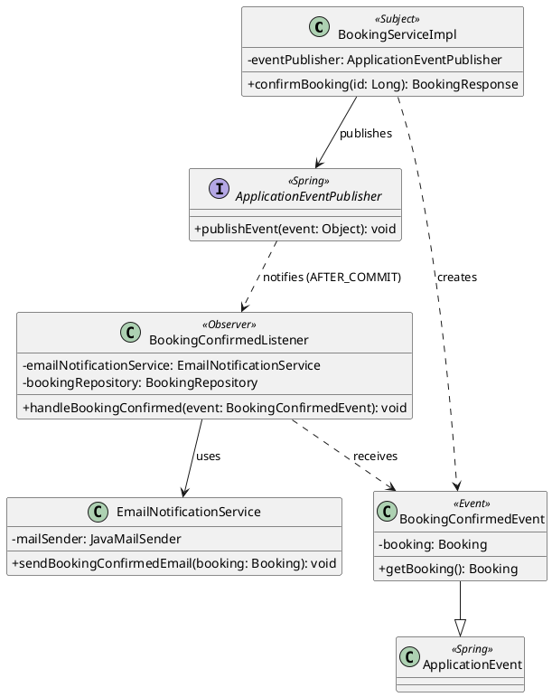

# Design Patterns

## สรุป

| Pattern | กลุ่ม | ปัญหาที่แก้ | ไฟล์ / คลาสหลัก | ผู้รับผิดชอบ |
|---|---|---|---|---|
| State | GoF Behavioral | แยกพฤติกรรมยืนยัน เช็กอิน เช็กเอาต์ และยกเลิกตามสถานะการจอง เพื่อป้องกันการเปลี่ยนสถานะที่ผิดลำดับ | `state/`, `service/impl/BookingServiceImpl.java`, `domain/entity/Booking.java` | กิติญาดา |
| Strategy | GoF Behavioral | แยกกฎคำนวณค่าห้อง บริการเสริม ค่าธรรมเนียมวันหยุด และส่วนลด เพื่อเพิ่มหรือแก้กฎแต่ละแบบได้แยกกัน | `pricing/`, `service/impl/PricingServiceImpl.java` | นาเดีย |
| Observer | GoF Behavioral | แยกการแจ้งเตือนลูกค้าออกจาก logic ยืนยันการจอง และส่งอีเมลเฉพาะเมื่อบันทึกสำเร็จจริง | `notification/` | กิตติธัช |
| Layered / MVC / Repository / Service Layer / DTO + Mapper / DI | Enterprise | แบ่งหน้าที่รับคำขอ แสดงผล ตรวจธุรกิจ เข้าถึงฐานข้อมูล และแปลงข้อมูล พร้อมให้ Spring จัดการ dependency เพื่อใช้ logic ร่วมกันและทดสอบแต่ละส่วนได้ | `controller/`, `service/`, `repository/`, `domain/`, `dto/`, `mapper/`, `resources/templates/` | ทั้งทีม |

---

## State Pattern — กิติญาดา

### ปัญหาที่แก้

การจองใน PetsHotel มีสถานะ `PENDING`, `CONFIRMED`, `CHECKED_IN`, `CHECKED_OUT` และ `CANCELLED` ซึ่งอนุญาตให้ทำรายการต่างกัน เช่น การจองที่รอยืนยันยังเช็กอินไม่ได้ การจองที่เช็กอินแล้วต้องเช็กเอาต์ก่อนจบการเข้าพัก และการจองที่ถูกยกเลิกไม่สามารถกลับมายืนยันได้

หากตรวจทุกสถานะด้วย `if` หรือ `switch` ซ้ำในเมธอดยืนยัน เช็กอิน เช็กเอาต์ และยกเลิก กฎของสถานะเดียวกันจะกระจายหลายจุด ทำให้แก้ไขยากและเสี่ยงอนุญาตให้เปลี่ยนสถานะผิดลำดับ

### วิธีแก้ด้วย State

กำหนด interface `BookingState` ที่มีเมธอด `confirm(booking)`, `checkIn(booking)`, `checkOut(booking)` และ `cancel(booking)` แล้วให้แต่ละ Concrete State กำหนดว่ารายการใดทำได้ หากทำได้จะเปลี่ยน `booking.status` หากทำไม่ได้จะโยน `IllegalStateException`

`BookingServiceImpl` ทำหน้าที่ Context โดยโหลดการจอง เลือก State ผ่าน `getState(booking.getStatus())` ตรวจเงื่อนไขเพิ่มเติม และเรียกพฤติกรรมผ่าน interface เดียวกัน ก่อนบันทึกผลลงฐานข้อมูล

| บทบาทใน Pattern | คลาสในระบบ | ไฟล์ |
|---|---|---|
| Context: เลือก State และประสานการทำรายการ | `BookingServiceImpl` | `service/impl/BookingServiceImpl.java` |
| State: สัญญาของการเปลี่ยนสถานะ | `BookingState` | `state/BookingState.java` |
| Concrete State: รอยืนยัน | `PendingState` | `state/PendingState.java` |
| Concrete State: ยืนยันแล้ว | `ConfirmedState` | `state/ConfirmedState.java` |
| Concrete State: เช็กอินแล้ว | `CheckedInState` | `state/CheckedInState.java` |
| Concrete State: เช็กเอาต์แล้ว | `CheckedOutState` | `state/CheckedOutState.java` |
| Concrete State: ยกเลิกแล้ว | `CancelledState` | `state/CancelledState.java` |
| ข้อมูลที่ State เปลี่ยน | `Booking` | `domain/entity/Booking.java` |
| ค่าสถานะที่บันทึกในฐานข้อมูล | `BookingStatus` | `domain/enums/BookingStatus.java` |

พาธ Java ในตารางอ้างอิงจาก `code/src/main/java/com/example/petshotel/`

### รายการที่แต่ละ State อนุญาต

| สถานะปัจจุบัน / Concrete State | `confirm()` | `checkIn()` | `checkOut()` | `cancel()` |
|---|---|---|---|---|
| `PENDING` / `PendingState` | → `CONFIRMED` | ไม่อนุญาต | ไม่อนุญาต | → `CANCELLED` |
| `CONFIRMED` / `ConfirmedState` | ไม่อนุญาต | → `CHECKED_IN` | ไม่อนุญาต | → `CANCELLED` |
| `CHECKED_IN` / `CheckedInState` | ไม่อนุญาต | ไม่อนุญาต | → `CHECKED_OUT` | ไม่อนุญาต |
| `CHECKED_OUT` / `CheckedOutState` | ไม่อนุญาต | ไม่อนุญาต | ไม่อนุญาต | ไม่อนุญาต |
| `CANCELLED` / `CancelledState` | ไม่อนุญาต | ไม่อนุญาต | ไม่อนุญาต | ไม่อนุญาต |

ตารางนี้แสดงพฤติกรรมของคลาส State การทำรายการผ่าน Service ต้องผ่านเงื่อนไขวันที่ การชำระเงิน และสิทธิ์ผู้ใช้ที่อธิบายด้านล่างด้วย

### รายละเอียดที่ออกแบบไว้

- **เลือก State จากข้อมูลที่บันทึกจริง** `getState(status)` ใช้ `switch` จับคู่ `BookingStatus` กับ Concrete State และสร้างด้วย `new` ทุกครั้งที่เรียกทำรายการ `Booking` เก็บ enum ในฐานข้อมูล ไม่ได้เก็บ object ของ `BookingState` เป็น field
- **State รับผิดชอบการเปลี่ยนสถานะ** เช่น `PendingState.confirm()` เรียก `booking.setStatus(BookingStatus.CONFIRMED)` ส่วนการโหลด บันทึก และประกาศเหตุการณ์อยู่ใน `BookingServiceImpl`
- **ตรวจวันที่ก่อนเปลี่ยนสถานะ** `checkIn()` เรียก `Booking.canCheckInOn(currentDate)` เมื่อเป็น `CONFIRMED` และ `checkOut()` เรียก `Booking.canCheckOutOn(currentDate)` เมื่อเป็น `CHECKED_IN` โดยใช้วันปัจจุบันในเขตเวลา `Asia/Bangkok`
- **เช็กอินได้ภายในช่วงเข้าพัก** ต้องเป็น `CONFIRMED` และ `checkInDate <= currentDate < checkOutDate` จึงเช็กอินก่อนกำหนดหรือในวันเช็กเอาต์ไม่ได้
- **เช็กเอาต์ได้ตั้งแต่วันออกที่กำหนด** ต้องเป็น `CHECKED_IN` และ `currentDate >= checkOutDate` โค้ดปัจจุบันไม่ได้บังคับให้ `paymentStatus` เป็น `PAID` ก่อนเช็กเอาต์
- **ป้องกันยกเลิกหลังชำระเงิน** `cancelBooking()` ตรวจ `paymentStatus == PAID` แล้วปฏิเสธก่อนเรียก `state.cancel()` จึงยกเลิกได้เฉพาะ `PENDING` หรือ `CONFIRMED` ที่ยังไม่ชำระเงิน
- **ตรวจสิทธิ์ก่อนเรียก Service** Controller จำกัดการยืนยัน เช็กอิน และเช็กเอาต์ให้ `STAFF` / `ADMIN` ลูกค้ายกเลิกได้เฉพาะการจองของตนเอง ส่วนพนักงานหรือผู้ดูแลยกเลิกผ่านช่องทางที่มีสิทธิ์ได้ State ไม่รับผิดชอบการตรวจบัญชีหรือ role
- **ใช้ transaction และล็อกการจองระหว่างแก้ไข** เมธอดเปลี่ยนสถานะโหลดผ่าน `findBookingForUpdate()` ซึ่งเรียก `BookingRepository.findByIdForUpdate()` ที่ใช้ `PESSIMISTIC_WRITE` เพื่อไม่ให้สอง transaction เปลี่ยนการจองเดียวกันพร้อมกัน
- **รายการที่ไม่อนุญาตไม่บันทึกสถานะใหม่** เมื่อ State หรือเงื่อนไขใน Service โยน `IllegalStateException` จะไม่เรียก `save()` ในเส้นทางนั้น เว็บแสดงข้อความผิดพลาด ส่วน REST API แปลงเป็น `409 Conflict` ผ่าน `GlobalExceptionHandler`
- **ทำงานร่วมกับ Observer** หลัง `confirm()` เปลี่ยนเป็น `CONFIRMED` และบันทึกแล้ว Service ประกาศ `BookingConfirmedEvent` การส่งอีเมลเกิดหลัง transaction commit ตามรายละเอียดในหัวข้อ Observer
- **แยกสถานะการจองกับการชำระเงิน** การจองใหม่มี `status = PENDING` และ `paymentStatus = UNPAID` การเปลี่ยน BookingStatus ผ่าน State ไม่ได้เปลี่ยน PaymentStatus โดยอัตโนมัติ

### Class Diagram และ State Diagram

[ดู Class Diagram ของระบบ](../img/diagrams/class-diagram.png)

กรอบ `Booking Management - State Pattern` แสดง `BookingServiceImpl` ในบทบาท Context, interface `BookingState` และ Concrete State ทั้งห้าคลาสที่ implements interface เดียวกัน

[ต้นฉบับ State Diagram](diagrams/state-booking.puml)


### ตัวอย่างโค้ดและลำดับการทำงาน

ตัวอย่างจาก `BookingServiceImpl.confirmBooking()`:

```java
Booking booking = findBookingForUpdate(id);
BookingState state = getState(booking.getStatus());

state.confirm(booking);

Booking savedBooking = bookingRepository.save(booking);
eventPublisher.publishEvent(
        new BookingConfirmedEvent(this, savedBooking));

return bookingMapper.toResponse(savedBooking);
```

1. พนักงานหรือผู้ดูแลส่งคำขอยืนยัน Controller ตรวจสิทธิ์แล้วเรียก `confirmBooking(id)`
2. Service โหลดและล็อกการจอง ถ้าไม่พบจะโยน `ResourceNotFoundException`
3. `getState(booking.getStatus())` เลือกคลาสตามสถานะ เช่น `PENDING` จะได้ `PendingState`
4. `state.confirm(booking)` เปลี่ยนเป็น `CONFIRMED` หากเป็น State ที่ไม่อนุญาต จะโยน `IllegalStateException` และหยุดก่อนบันทึกหรือประกาศเหตุการณ์
5. Service บันทึกการจอง ประกาศ `BookingConfirmedEvent` และแปลงผลด้วย `BookingMapper`
6. เมื่อ transaction commit สำเร็จ Listener ใน Observer Pattern จึงรับเหตุการณ์เพื่อส่งอีเมลยืนยัน

### ประโยชน์และขอบเขตของการออกแบบ

กฎของแต่ละสถานะรวมอยู่ในคลาสเดียว ทำให้ตรวจเส้นทางที่อนุญาตและปฏิเสธได้ชัดเจน การแก้พฤติกรรมของสถานะเดิมทำใน Concrete State นั้นได้ โดยผู้เรียกยังใช้เมธอดของ `BookingService` เหมือนเดิม

การเพิ่มสถานะใหม่ยังต้องเพิ่มค่าใน `BookingStatus`, สร้าง Concrete State และปรับ `getState()` รวมถึงกฎวันที่ การตรวจห้อง/สัตว์ว่าง และส่วนแสดงผลที่อ้างอิงสถานะ จึงไม่ได้หมายความว่าเพิ่มสถานะใหม่ได้โดยไม่แก้โค้ดเดิมเลย

ชุดทดสอบที่มีอยู่ใน [BookingServiceTest.java](../code/src/test/java/com/example/petshotel/service/BookingServiceTest.java) มีตัวอย่างตรวจการยืนยัน `PENDING`, การปฏิเสธยืนยัน `CANCELLED`, การยกเลิก `CONFIRMED` ที่ยังไม่ชำระเงิน, การห้ามยกเลิกหลังชำระเงิน และข้อจำกัดวันเช็กอิน/เช็กเอาต์

โค้ดหลัก: [BookingServiceImpl.java](../code/src/main/java/com/example/petshotel/service/impl/BookingServiceImpl.java), [BookingState.java](../code/src/main/java/com/example/petshotel/state/BookingState.java), [Booking.java](../code/src/main/java/com/example/petshotel/domain/entity/Booking.java), [BookingRepository.java](../code/src/main/java/com/example/petshotel/repository/BookingRepository.java)

---

## Observer Pattern

### ปัญหาที่แก้

เมื่อพนักงานยืนยันการจอง ระบบต้องแจ้งลูกค้าทางอีเมล ถ้าเขียนการส่งอีเมลไว้ใน `BookingServiceImpl.confirmBooking()` โดยตรง จะเกิดปัญหา 3 ข้อ

1. **ผูกติดกัน (tight coupling)** `BookingServiceImpl` ต้องรู้จักระบบอีเมล ถ้าวันหลังอยากเพิ่ม SMS หรือ LINE ต้องกลับไปแก้ service การจอง ซึ่งผิดหลัก Open/Closed
2. **ส่งอีเมลก่อนบันทึกจริง** ถ้าส่งอีเมลระหว่าง transaction แล้วการบันทึกล้มเหลวทีหลัง ลูกค้าจะได้อีเมลยืนยันการจองที่ไม่ได้ถูกยืนยันจริง
3. **อีเมลล้มทำให้การยืนยันล้ม** ถ้า SMTP ใช้งานไม่ได้ ไม่ควรทำให้การยืนยันการจองล้มเหลวไปด้วย

### วิธีแก้ด้วย Observer

`BookingServiceImpl` (Subject) แค่**ประกาศเหตุการณ์** `BookingConfirmedEvent` ผ่าน `ApplicationEventPublisher` ของ Spring โดยไม่รู้ว่าใครรับฟังอยู่ ส่วน `BookingConfirmedListener` (Observer) รับเหตุการณ์แล้วสั่ง `EmailNotificationService` ส่งอีเมล

| บทบาทใน Pattern | คลาสในระบบ | ไฟล์ |
|---|---|---|
| Subject (ผู้ประกาศ) | `BookingServiceImpl.confirmBooking()` ผ่าน `ApplicationEventPublisher` | `service/impl/BookingServiceImpl.java` |
| Event (ข้อมูลที่ส่ง) | `BookingConfirmedEvent extends ApplicationEvent` | `notification/BookingConfirmedEvent.java` |
| Observer (ผู้รับฟัง) | `BookingConfirmedListener` | `notification/BookingConfirmedListener.java` |
| ผู้ทำงานจริง | `EmailNotificationService` ใช้ `JavaMailSender` | `notification/EmailNotificationService.java` |

### รายละเอียดที่ออกแบบไว้

- **`@TransactionalEventListener(phase = AFTER_COMMIT)`** Listener ทำงานหลังบันทึกสถานะ `CONFIRMED` ลงฐานข้อมูลสำเร็จแล้วเท่านั้น ถ้า transaction ถูก rollback จะไม่ส่งอีเมล (แก้ปัญหาข้อ 2)
- **`@Transactional(propagation = REQUIRES_NEW, readOnly = true)`** Listener เปิด transaction ใหม่แบบอ่านอย่างเดียว เพื่อโหลดข้อมูลการจอง (ลูกค้า ห้อง วันที่ ราคา) จากฐานข้อมูลอีกครั้ง เพราะ transaction เดิมปิดไปแล้ว
- **จับ `MailException` / `MessagingException`** ส่งอีเมลไม่สำเร็จจะบันทึก log แต่การจองยังเป็น `CONFIRMED` (แก้ปัญหาข้อ 3)
- **เพิ่มช่องทางแจ้งเตือนใหม่ได้โดยไม่แก้โค้ดเดิม** เช่นเพิ่ม `SmsNotificationListener` ที่รับ `BookingConfirmedEvent` เหมือนกัน `BookingServiceImpl` ไม่ต้องแก้แม้แต่บรรทัดเดียว (แก้ปัญหาข้อ 1)

### Class Diagram



### ลำดับการทำงาน

1. พนักงานกดยืนยันการจอง → `BookingServiceImpl.confirmBooking()` เปลี่ยนสถานะผ่าน State Pattern แล้วบันทึก
2. `eventPublisher.publishEvent(new BookingConfirmedEvent(this, savedBooking))`
3. transaction commit สำเร็จ → Spring เรียก `BookingConfirmedListener.handleBookingConfirmed()`
4. Listener โหลดการจองใหม่ด้วย `bookingRepository.findById()`
5. `EmailNotificationService.sendBookingConfirmedEmail()` สร้างอีเมล HTML แล้วส่งผ่าน `JavaMailSender`

ทดสอบได้จริงด้วย Docker: อีเมลจะไปแสดงที่ Mailpit `http://localhost:8025`

---

## Strategy Pattern

### ปัญหาที่แก้

ราคาการจองของ petshotel ประกอบด้วยค่าห้องพัก ค่าบริการเสริม ค่าธรรมเนียมวันหยุด และส่วนลดหลายประเภท หากรวมทุกสูตรไว้ในเมธอดเดียว จะทำให้โค้ดยาว แก้ไขยาก และการเพิ่มกฎใหม่อาจกระทบสูตรเดิม

ระบบจึงแยกกฎแต่ละแบบเป็นคลาสที่ implements `PricingStrategy` และให้ `PricingServiceImpl` เรียกคำนวณผ่าน interface เดียวกัน

### วิธีแก้ด้วย Strategy

`PricingServiceImpl` เป็น Context ที่ประสานการคำนวณ โดยรับ `List<PricingStrategy>` ผ่าน constructor injection ของ Spring ส่วนแต่ละ Concrete Strategy รับผิดชอบสูตรและเงื่อนไขของตนเอง

`PricingContext` เป็นข้อมูลที่ส่งให้ Strategy เช่น ห้อง จำนวนสัตว์ จำนวนคืน ช่วงวันเข้าพัก บริการเสริม และโปรโมชัน โดยเป็นคนละบทบาทกับ Context ที่ควบคุมการเรียก Strategy

| บทบาทใน Pattern | คลาสในระบบ | ไฟล์ |
|---|---|---|
| Context: ประสานการคำนวณ | `PricingServiceImpl` | `service/impl/PricingServiceImpl.java` |
| Strategy: สัญญาการคำนวณ | `PricingStrategy` | `pricing/PricingStrategy.java` |
| Concrete Strategy: ค่าห้อง | `BaseRoomPriceStrategy` | `pricing/BaseRoomPriceStrategy.java` |
| Concrete Strategy: บริการเสริม | `ExtraServicePricingStrategy` | `pricing/ExtraServicePricingStrategy.java` |
| Concrete Strategy: ค่าธรรมเนียมวันหยุด | `HolidaySurchargeStrategy` | `pricing/HolidaySurchargeStrategy.java` |
| Concrete Strategy: ส่วนลดพักระยะยาว | `LongStayDiscountStrategy` | `pricing/LongStayDiscountStrategy.java` |
| Concrete Strategy: ส่วนลดโปรโมชัน | `PromotionDiscountStrategy` | `pricing/PromotionDiscountStrategy.java` |
| ข้อมูลสำหรับคำนวณ | `PricingContext` | `pricing/PricingContext.java` |
| หมวดผลการคำนวณ | `PricingCategory` | `domain/enums/PricingCategory.java` |
| ผลลัพธ์ราคา | `BookingPriceResponse` | `dto/response/BookingPriceResponse.java` |

### รายละเอียดที่ออกแบบไว้

- `PricingStrategy` กำหนดเมธอด `calculate(context, subtotal)` ซึ่งคืนจำนวนเงินเป็น `BigDecimal` และ `category()` ซึ่งคืนหมวดราคา
- Concrete Strategy ทั้งห้าคลาส implements interface เดียวกันและลงทะเบียนเป็น Spring bean ด้วย `@Component`
- `PricingServiceImpl` รับ Strategy เป็นรายการผ่าน constructor โดยไม่สร้าง Concrete Strategy ด้วย `new` เอง
- ระบบเรียกหลาย Strategy เพื่อประกอบราคาหนึ่งรายการ โดยแยกการคำนวณค่าใช้จ่ายออกจากส่วนลด

| Strategy | หมวด | สูตรหรือเงื่อนไข |
|---|---|---|
| `BaseRoomPriceStrategy` | `ROOM` | ราคาต่อสัตว์ต่อคืน × จำนวนคืน × จำนวนสัตว์ |
| `ExtraServicePricingStrategy` | `EXTRA_SERVICE` | รวม `unitPrice × quantity` ของรายการบริการเสริม |
| `HolidaySurchargeStrategy` | `HOLIDAY_SURCHARGE` | ราคาห้องต่อคืนรวมสัตว์ทุกตัว × 30% × จำนวนคืนที่ตรงกับวันหยุดในโค้ด |
| `LongStayDiscountStrategy` | `DISCOUNT` | พักอย่างน้อย 5 คืน รับส่วนลด 10% ของยอดก่อนหักส่วนลด |
| `PromotionDiscountStrategy` | `DISCOUNT` | ลดเป็นเปอร์เซ็นต์หรือจำนวนเงินตามโปรโมชัน และตรวจจำนวนคืนขั้นต่ำถ้ามี |

- วันหยุดที่ `HolidaySurchargeStrategy` กำหนดไว้ในโค้ดคือ 1 มกราคม, 13–15 เมษายน และ 31 ธันวาคม โดยตรวจวันเข้าพักแต่ละคืน ไม่รวมวันเช็กเอาต์
- `PromotionDiscountStrategy` คืนส่วนลด 0 เมื่อไม่มีโปรโมชัน โปรโมชันปิดใช้งาน หรือจำนวนคืนไม่ถึงขั้นต่ำ
- การตรวจช่วงวันที่ของโปรโมชันก่อนสร้างการจองอยู่ใน `BookingServiceImpl` ส่วน `PromotionDiscountStrategy` รับผิดชอบสูตรส่วนลดและเงื่อนไขจำนวนคืน
- หากมีส่วนลดหลายแบบ ระบบเลือกจำนวนเงินส่วนลดที่สูงที่สุดด้วย `max()` โดยไม่รวมส่วนลดทุกแบบเข้าด้วยกัน
- ส่วนลดสุดท้ายไม่เกินยอดก่อนหักส่วนลด จึงไม่ทำให้ยอดสุทธิติดลบสำหรับข้อมูลราคาที่ถูกต้อง
- ระบบปัดจำนวนเงินเป็นทศนิยม 2 ตำแหน่งด้วย `RoundingMode.HALF_UP`
- สามารถเพิ่ม Strategy ในหมวดเดิมได้โดยสร้างคลาสที่ implements `PricingStrategy` และลงทะเบียนเป็น Spring bean ส่วนการเพิ่มหมวดใหม่อาจต้องปรับ `PricingCategory` และการรวมผลใน `PricingServiceImpl`

### Class Diagram

[ดู Class Diagram ของระบบ](../img/diagrams/class-diagram.png)

กรอบ `Pricing - Strategy Pattern` แสดง `PricingServiceImpl` ที่ถือรายการ `PricingStrategy` คลาส Concrete Strategy ทั้งห้าที่ implements interface รวมถึง `PricingContext`, `PricingCategory` และ `BookingPriceResponse`

### ลำดับการทำงาน

1. ผู้เรียกส่งข้อมูลห้อง จำนวนสัตว์ วันเช็กอิน วันเช็กเอาต์ บริการเสริม และโปรโมชันให้ `PricingServiceImpl.calculate()`
2. Service ตรวจข้อมูลและคำนวณจำนวนคืนจากวันเช็กอินถึงวันเช็กเอาต์ แล้วสร้าง `PricingContext` สำหรับใช้งาน โดยไม่ใช้จำนวนคืนที่ผู้เรียกส่งมาโดยตรง
3. Service เรียก Strategy ที่ไม่ใช่หมวด `DISCOUNT` และรวมผลตามหมวดราคา
4. ปัดค่าห้อง บริการเสริม และค่าธรรมเนียมวันหยุดเป็นทศนิยม 2 ตำแหน่ง แล้วรวมเป็นยอดก่อนหักส่วนลด
5. Service เรียก Strategy หมวด `DISCOUNT` โดยส่งยอดก่อนหักส่วนลดให้แต่ละคลาส
6. เลือกส่วนลดที่สูงที่สุด ปัดเป็นทศนิยม 2 ตำแหน่ง และจำกัดไม่ให้เกินยอดก่อนหักส่วนลด
7. คำนวณยอดสุทธิและคืน `BookingPriceResponse` ซึ่งมีค่าห้อง บริการเสริม ค่าธรรมเนียมวันหยุด ส่วนลด และยอดรวม

### ตัวอย่างการคำนวณ

สมมติว่ามีสัตว์เลี้ยง 1 ตัว ราคาห้อง 500.00 บาทต่อตัวต่อคืน เข้าพักวันที่ 1–6 ตุลาคม 2026 รวม 5 คืน มีบริการอาบน้ำ 250.00 บาท และเลือกโปรโมชันส่วนลด 20% ที่ผ่านการตรวจวันและเงื่อนไขแล้ว

| รายการ | การคำนวณ | จำนวนเงิน |
|---|---|---|
| ค่าห้อง | 500.00 × 5 × 1 | 2,500.00 บาท |
| บริการเสริม | 250.00 × 1 | 250.00 บาท |
| ค่าธรรมเนียมวันหยุด | ไม่มีคืนที่ตรงกับวันหยุดในโค้ด | 0.00 บาท |
| ยอดก่อนหักส่วนลด | 2,500.00 + 250.00 + 0.00 | 2,750.00 บาท |
| ส่วนลดพักระยะยาวที่คำนวณได้ | 2,750.00 × 10% | 275.00 บาท |
| ส่วนลดโปรโมชันที่คำนวณได้ | 2,750.00 × 20% | 550.00 บาท |
| ส่วนลดที่เลือกใช้ | ค่าสูงสุดระหว่าง 275.00 กับ 550.00 | 550.00 บาท |
| **ยอดสุทธิ** | **2,750.00 − 550.00** | **2,200.00 บาท** |

ตัวอย่างนี้แสดงว่าทั้งสอง Strategy คำนวณส่วนลดได้ แต่ Service เลือกใช้ส่วนลดที่สูงกว่าเพียงจำนวนเดียว

---

## Enterprise Patterns — ทั้งทีม

### ปัญหาที่แก้

ระบบมีทั้งหน้าเว็บสำหรับลูกค้า/พนักงานและ REST API ซึ่งใช้กฎการจองชุดเดียวกัน หากรวมการรับ HTTP การตรวจธุรกิจ การอ่านเขียนฐานข้อมูล และการจัดรูปแบบผลลัพธ์ไว้ด้วยกัน จะเกิดโค้ดซ้ำและแก้ไขแต่ละส่วนได้ยาก

PetsHotel จึงแบ่งส่วนเหล่านี้ด้วย Layered Architecture, MVC, Repository, Service Layer, DTO + Mapper และ Dependency Injection โดยแต่ละแนวทางทำงานร่วมกันตามหน้าที่ของตนเอง

### 1. Layered Architecture

| ชั้น / ส่วนของระบบ | หน้าที่ | ตัวอย่างในโค้ด |
|---|---|---|
| Presentation | รับคำขอ ตรวจข้อมูลจาก HTTP/ฟอร์ม และส่งผลให้ผู้ใช้ | `controller/web/BookingController`, `controller/api/BookingRestController`, `resources/templates/booking.html` |
| Service / Application | ประสานขั้นตอนธุรกิจและกำหนด transaction | `service/BookingService`, `service/impl/BookingServiceImpl` |
| Domain | เก็บข้อมูลและกฎของการจอง รวมถึงพฤติกรรมตามสถานะ | `domain/entity/Booking`, `domain/enums/BookingStatus`, `state/` |
| Data Access | อ่าน เขียน ค้นหา และล็อกข้อมูลผ่าน Spring Data JPA | `repository/BookingRepository`, `RoomRepository`, `PetRepository` |
| DTO / Mapping | กำหนดข้อมูลเข้าออกและแปลง Entity เป็นผลลัพธ์ | `dto/request/`, `dto/response/`, `mapper/BookingMapper` |

เส้นทางหลักของการจองคือ `Controller → BookingService → Repository → ฐานข้อมูล` โดย Service ใช้ Entity, State และบริการคำนวณราคา แล้วส่ง `BookingResponse` กลับผ่าน Mapper การแบ่งชั้นช่วยให้เปลี่ยนหน้าเว็บหรือรูปแบบ API ได้โดยยังเรียกกฎธุรกิจชุดเดิม

### 2. Model–View–Controller (MVC)

- **Model** คือข้อมูลและกฎของระบบ เช่น `Booking`, `BookingStatus` และการทำรายการผ่าน `BookingService` ส่วน `org.springframework.ui.Model` เป็นตัวส่งข้อมูลที่ Controller เตรียมให้ View
- **View** คือ Thymeleaf templates เช่น `templates/booking.html`, `my-bookings.html`, `booking-detail.html` และ `admin/bookings.html`
- **Controller** เช่น `BookingController` รับคำขอจากลูกค้า เรียก Service ใส่ข้อมูลใน Model และเลือก View หรือ redirect

ตัวอย่าง `BookingController.showMyBookings()` อ่านผู้ใช้จาก `Principal` เรียก `bookingService.getBookingsByUserId(user.getId())` ใส่ผลใน Model ชื่อ `bookings` แล้วคืนชื่อ View `my-bookings`

`BookingRestController` เป็นช่องทาง HTTP ที่คืน DTO เป็น JSON แทนการเลือก Thymeleaf View และใช้ `BookingService` ร่วมกับหน้าเว็บ

### 3. Repository Pattern

`BookingRepository extends JpaRepository<Booking, Long>` รวมการเข้าถึงข้อมูลการจองไว้ที่ interface เดียว Service จึงเรียกเมธอดของ Repository โดยไม่เขียนคำสั่งฐานข้อมูลซ้ำใน Controller

| เมธอด | หน้าที่ |
|---|---|
| `save(booking)` | บันทึกหรืออัปเดตการจองผ่าน Spring Data JPA |
| `findByUserId(userId)` | ค้นการจองของลูกค้า |
| `findById(id)` | อ่านการจองตามรหัส |
| `findByIdForUpdate(id)` | โหลดการจองพร้อม `PESSIMISTIC_WRITE` lock ภายใน transaction |
| `existsOverlappingBooking(...)` | ตรวจว่าห้องมีการจองทับช่วงวันในสถานะที่ยังครองห้องหรือไม่ |

Spring Data JPA สร้าง implementation ของ Repository ให้ ส่วน query เฉพาะธุรกิจอยู่ใน `@Query` ของ interface การแยกนี้ช่วยรวมรายละเอียดการเข้าถึงข้อมูลและใช้ Repository แทนด้วย mock ในการทดสอบ Service ได้

### 4. Service Layer

`BookingService` กำหนดรายการที่ระบบให้บริการ เช่น `createBooking()`, `previewPrice()`, `confirmBooking()`, `checkIn()`, `checkOut()` และ `cancelBooking()` ส่วน `BookingServiceImpl` ประสาน Repository, Availability, Pricing, State, Mapper และ Event Publisher

- การสร้างการจองตรวจข้อมูล เจ้าของสัตว์ ความจุ สัตว์/ห้องที่จองซ้อน บริการ และโปรโมชัน ก่อนคำนวณราคาและบันทึก
- การเปลี่ยนสถานะใช้ State Pattern และตรวจเงื่อนไขวันที่/การชำระเงินใน Service
- `@Transactional` ที่คลาสครอบการทำรายการ ส่วนเมธอดอ่านข้อมูลและราคา preview ใช้ `@Transactional(readOnly = true)`
- Controller ฝั่งเว็บและ API เรียก Service เดียวกัน จึงใช้กฎธุรกิจร่วมกัน โดย Controller ยังรับผิดชอบรูปแบบ HTTP การตรวจบัญชี/สิทธิ์ และการแสดงข้อผิดพลาด

### 5. DTO + Mapper

DTO กำหนดข้อมูลที่แต่ละคำขอหรือผลลัพธ์ต้องใช้ โดยแยกจาก JPA Entity ที่มีความสัมพันธ์กับข้อมูลอื่น

| DTO / Mapper | หน้าที่ |
|---|---|
| `CreateBookingApiRequest` | รับ JSON ที่มี `roomId`, `petIds`, วันที่ บริการ และโปรโมชัน โดยไม่มี `userId` ให้ client กำหนด |
| `CreateBookingRequest` | รับข้อมูลฟอร์มและส่งข้อมูลให้ Service รวม `userId` ที่ Controller กำหนดจากบัญชีที่ล็อกอิน |
| `BookingPriceResponse` | ส่งผลราคา preview และส่วนประกอบราคา |
| `BookingResponse` | ส่งข้อมูลการจอง สถานะ ราคา ห้อง สัตว์ และรายการบริการให้เว็บ/API |
| `BookingMapper.toResponse(booking)` | แปลง Entity และความสัมพันธ์ที่ต้องใช้ให้เป็น `BookingResponse` |

`BookingMapper` เป็นคลาส `@Component` ที่แปลงข้อมูลด้วยโค้ด Java เช่นดึง `userId`, `roomId`, รายชื่อสัตว์ และรายการบริการ พร้อมคำนวณ `checkInAllowed` / `checkOutAllowed` จากวันปัจจุบันใน `Asia/Bangkok` จึงไม่ส่ง JPA Entity ทั้งกราฟออกไปโดยตรง

ทั้ง API และเว็บกำหนดผู้จองจากผู้ใช้ที่ล็อกอิน ฝั่งเว็บใช้ `@InitBinder` จำกัด field ที่รับจากฟอร์มและกำหนด `form.setUserId(user.getId())` ใหม่ ส่วน API สร้าง `CreateBookingRequest` จาก DTO และบัญชีปัจจุบัน

### 6. Dependency Injection (DI)

Spring จัดการ dependency ของ Controller, Service และ Mapper ผ่าน constructor injection เช่น `BookingServiceImpl` ประกาศ dependency เป็น `private final` และใช้ Lombok `@RequiredArgsConstructor` สร้าง constructor ให้ Spring ส่ง bean ที่เหมาะสมเข้ามา

ตัวอย่าง dependency ได้แก่ `BookingRepository`, `PricingService`, `AvailabilityService`, `BookingMapper` และ `ApplicationEventPublisher` ส่วน `PricingServiceImpl` รับ `List<PricingStrategy>` ผ่าน constructor เพื่อใช้ Strategy ทุกตัวที่ลงทะเบียนเป็น bean

การออกแบบนี้ทำให้คลาสระบุสิ่งที่ต้องใช้ชัดเจน และชุดทดสอบส่ง mock ของ dependency เข้าไปได้โดยไม่ต้องเชื่อมฐานข้อมูลหรือส่งอีเมลจริง ทั้งนี้ Concrete State ใน `getState()` ยังสร้างด้วย `new` ตามโค้ดปัจจุบัน ไม่ได้เป็น bean ที่ Spring inject ให้

### ตัวอย่างการทำงานร่วมกัน

1. View ส่งฟอร์มไป `BookingController` หรือ client ส่ง JSON ไป `BookingRestController`
2. Controller ตรวจคำขอและบัญชีผู้ใช้ แล้วเตรียม `CreateBookingRequest` โดยกำหนด `userId` จาก `Principal`
3. Controller เรียก `BookingService.createBooking()` โดย Spring inject `BookingServiceImpl` ให้
4. Service ตรวจธุรกิจและประสาน Repository/Availability/Pricing ภายใน transaction
5. Repository บันทึก `Booking` และรายการที่มี cascade ผ่าน JPA
6. `BookingMapper` แปลง Entity เป็น `BookingResponse` และ transaction commit เมื่อทำรายการสำเร็จ
7. ฝั่งเว็บ redirect ไปหน้ารายละเอียดการจอง ส่วน REST API คืน `201 Created` พร้อม `BookingResponse` เป็น JSON

โค้ดอ้างอิง: [BookingController.java](../code/src/main/java/com/example/petshotel/controller/web/BookingController.java), [BookingRestController.java](../code/src/main/java/com/example/petshotel/controller/api/BookingRestController.java), [BookingService.java](../code/src/main/java/com/example/petshotel/service/BookingService.java), [BookingServiceImpl.java](../code/src/main/java/com/example/petshotel/service/impl/BookingServiceImpl.java), [BookingRepository.java](../code/src/main/java/com/example/petshotel/repository/BookingRepository.java), [BookingMapper.java](../code/src/main/java/com/example/petshotel/mapper/BookingMapper.java)
