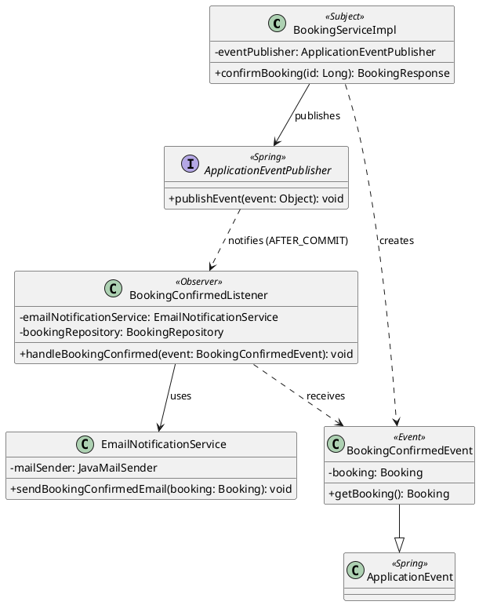

# Design Patterns

## สรุป

| Pattern | กลุ่ม | ปัญหาที่แก้ | ไฟล์ / คลาสหลัก | ผู้รับผิดชอบ |
|---|---|---|---|---|
| State | GoF Behavioral | _(กิตติญาดา)_ | `state/` | กิตติญาดา |
| Strategy | GoF Behavioral | แยกกฎคำนวณค่าห้อง บริการเสริม ค่าธรรมเนียมวันหยุด และส่วนลด เพื่อเพิ่มหรือแก้กฎแต่ละแบบได้แยกกัน | `pricing/`, `service/impl/PricingServiceImpl.java` | นาเดีย |
| Observer | GoF Behavioral | แยกการแจ้งเตือนลูกค้าออกจาก logic ยืนยันการจอง และส่งอีเมลเฉพาะเมื่อบันทึกสำเร็จจริง | `notification/` | กิตติรัช |
| Layered / MVC / Repository / Service Layer / DTO + Mapper / DI | Enterprise | _(เติมภายหลัง)_ | ทั้งโปรเจกต์ | ทั้งทีม |

---

## Observer Pattern

### ปัญหาที่แก้

เมื่อพนักงานยืนยันการจอง ระบบต้องแจ้งลูกค้าทางอีเมล ถ้าเขียนการส่งอีเมลไว้ใน `BookingServiceImpl.confirmBooking()` โดยตรง จะเกิดปัญหา 3 ข้อ

1. **ผูกติดกัน (tight coupling)** `BookingServiceImpl` ต้องรู้จักระบบอีเมล ถ้าวันหลังอยากเพิ่ม SMS หรือ LINE ต้องกลับไปแก้ service การจอง ซึ่งผิดหลัก Open/Closed
2. **ส่งอีเมลก่อนบันทึกจริง** ถ้าส่งอีเมลระหว่าง transaction แล้วการบันทึกล้มเหลวทีหลัง ลูกค้าจะได้อีเมลยืนยันการจองที่ไม่ได้ถูกยืนยันจริง
3. **อีเมลล้มทำให้การยืนยันล้ม** ถ้า SMTP ใช้งานไม่ได้ ไม่ควรทำให้การยืนยันการจองล้มเหลวไปด้วย

### วิธีแก้ด้วย Observer

`BookingServiceImpl` (Subject) แค่**ประกาศเหตุการณ์** `BookingConfirmedEvent` ผ่าน `ApplicationEventPublisher` ของ Spring โดยไม่รู้ว่าใครรับฟังอยู่ ส่วน `BookingConfirmedListener` (Observer) รับเหตุการณ์แล้วสั่ง `EmailNotificationService` ส่งอีเมล

| บทบาทใน Pattern | คลาสในระบบ | ไฟล์ |
|---|---|---|
| Subject (ผู้ประกาศ) | `BookingServiceImpl.confirmBooking()` ผ่าน `ApplicationEventPublisher` | `service/impl/BookingServiceImpl.java` |
| Event (ข้อมูลที่ส่ง) | `BookingConfirmedEvent extends ApplicationEvent` | `notification/BookingConfirmedEvent.java` |
| Observer (ผู้รับฟัง) | `BookingConfirmedListener` | `notification/BookingConfirmedListener.java` |
| ผู้ทำงานจริง | `EmailNotificationService` ใช้ `JavaMailSender` | `notification/EmailNotificationService.java` |

### รายละเอียดที่ออกแบบไว้

- **`@TransactionalEventListener(phase = AFTER_COMMIT)`** Listener ทำงานหลังบันทึกสถานะ `CONFIRMED` ลงฐานข้อมูลสำเร็จแล้วเท่านั้น ถ้า transaction ถูก rollback จะไม่ส่งอีเมล (แก้ปัญหาข้อ 2)
- **`@Transactional(propagation = REQUIRES_NEW, readOnly = true)`** Listener เปิด transaction ใหม่แบบอ่านอย่างเดียว เพื่อโหลดข้อมูลการจอง (ลูกค้า ห้อง วันที่ ราคา) จากฐานข้อมูลอีกครั้ง เพราะ transaction เดิมปิดไปแล้ว
- **จับ `MailException` / `MessagingException`** ส่งอีเมลไม่สำเร็จจะบันทึก log แต่การจองยังเป็น `CONFIRMED` (แก้ปัญหาข้อ 3)
- **เพิ่มช่องทางแจ้งเตือนใหม่ได้โดยไม่แก้โค้ดเดิม** เช่นเพิ่ม `SmsNotificationListener` ที่รับ `BookingConfirmedEvent` เหมือนกัน `BookingServiceImpl` ไม่ต้องแก้แม้แต่บรรทัดเดียว (แก้ปัญหาข้อ 1)

### Class Diagram

### ลำดับการทำงาน

1. พนักงานกดยืนยันการจอง → `BookingServiceImpl.confirmBooking()` เปลี่ยนสถานะผ่าน State Pattern แล้วบันทึก
2. `eventPublisher.publishEvent(new BookingConfirmedEvent(this, savedBooking))`
3. transaction commit สำเร็จ → Spring เรียก `BookingConfirmedListener.handleBookingConfirmed()`
4. Listener โหลดการจองใหม่ด้วย `bookingRepository.findById()`
5. `EmailNotificationService.sendBookingConfirmedEmail()` สร้างอีเมล HTML แล้วส่งผ่าน `JavaMailSender`

ทดสอบได้จริงด้วย Docker: อีเมลจะไปแสดงที่ Mailpit `http://localhost:8025`

---

## Strategy Pattern

### ปัญหาที่แก้

ราคาการจองของ petshotel ประกอบด้วยค่าห้องพัก ค่าบริการเสริม ค่าธรรมเนียมวันหยุด และส่วนลดหลายประเภท หากรวมทุกสูตรไว้ในเมธอดเดียว จะทำให้โค้ดยาว แก้ไขยาก และการเพิ่มกฎใหม่อาจกระทบสูตรเดิม

ระบบจึงแยกกฎแต่ละแบบเป็นคลาสที่ implements `PricingStrategy` และให้ `PricingServiceImpl` เรียกคำนวณผ่าน interface เดียวกัน

### วิธีแก้ด้วย Strategy

`PricingServiceImpl` เป็น Context ที่ประสานการคำนวณ โดยรับ `List<PricingStrategy>` ผ่าน constructor injection ของ Spring ส่วนแต่ละ Concrete Strategy รับผิดชอบสูตรและเงื่อนไขของตนเอง

`PricingContext` เป็นข้อมูลที่ส่งให้ Strategy เช่น ห้อง จำนวนสัตว์ จำนวนคืน ช่วงวันเข้าพัก บริการเสริม และโปรโมชัน โดยเป็นคนละบทบาทกับ Context ที่ควบคุมการเรียก Strategy

| บทบาทใน Pattern | คลาสในระบบ | ไฟล์ |
|---|---|---|
| Context: ประสานการคำนวณ | `PricingServiceImpl` | `service/impl/PricingServiceImpl.java` |
| Strategy: สัญญาการคำนวณ | `PricingStrategy` | `pricing/PricingStrategy.java` |
| Concrete Strategy: ค่าห้อง | `BaseRoomPriceStrategy` | `pricing/BaseRoomPriceStrategy.java` |
| Concrete Strategy: บริการเสริม | `ExtraServicePricingStrategy` | `pricing/ExtraServicePricingStrategy.java` |
| Concrete Strategy: ค่าธรรมเนียมวันหยุด | `HolidaySurchargeStrategy` | `pricing/HolidaySurchargeStrategy.java` |
| Concrete Strategy: ส่วนลดพักระยะยาว | `LongStayDiscountStrategy` | `pricing/LongStayDiscountStrategy.java` |
| Concrete Strategy: ส่วนลดโปรโมชัน | `PromotionDiscountStrategy` | `pricing/PromotionDiscountStrategy.java` |
| ข้อมูลสำหรับคำนวณ | `PricingContext` | `pricing/PricingContext.java` |
| หมวดผลการคำนวณ | `PricingCategory` | `domain/enums/PricingCategory.java` |
| ผลลัพธ์ราคา | `BookingPriceResponse` | `dto/response/BookingPriceResponse.java` |

### รายละเอียดที่ออกแบบไว้

- `PricingStrategy` กำหนดเมธอด `calculate(context, subtotal)` ซึ่งคืนจำนวนเงินเป็น `BigDecimal` และ `category()` ซึ่งคืนหมวดราคา
- Concrete Strategy ทั้งห้าคลาส implements interface เดียวกันและลงทะเบียนเป็น Spring bean ด้วย `@Component`
- `PricingServiceImpl` รับ Strategy เป็นรายการผ่าน constructor โดยไม่สร้าง Concrete Strategy ด้วย `new` เอง
- ระบบเรียกหลาย Strategy เพื่อประกอบราคาหนึ่งรายการ โดยแยกการคำนวณค่าใช้จ่ายออกจากส่วนลด

| Strategy | หมวด | สูตรหรือเงื่อนไข |
|---|---|---|
| `BaseRoomPriceStrategy` | `ROOM` | ราคาต่อสัตว์ต่อคืน × จำนวนคืน × จำนวนสัตว์ |
| `ExtraServicePricingStrategy` | `EXTRA_SERVICE` | รวม `unitPrice × quantity` ของรายการบริการเสริม |
| `HolidaySurchargeStrategy` | `HOLIDAY_SURCHARGE` | ราคาห้องต่อคืนรวมสัตว์ทุกตัว × 30% × จำนวนคืนที่ตรงกับวันหยุดในโค้ด |
| `LongStayDiscountStrategy` | `DISCOUNT` | พักอย่างน้อย 5 คืน รับส่วนลด 10% ของยอดก่อนหักส่วนลด |
| `PromotionDiscountStrategy` | `DISCOUNT` | ลดเป็นเปอร์เซ็นต์หรือจำนวนเงินตามโปรโมชัน และตรวจจำนวนคืนขั้นต่ำถ้ามี |

- วันหยุดที่ `HolidaySurchargeStrategy` กำหนดไว้ในโค้ดคือ 1 มกราคม, 13–15 เมษายน และ 31 ธันวาคม โดยตรวจวันเข้าพักแต่ละคืน ไม่รวมวันเช็กเอาต์
- `PromotionDiscountStrategy` คืนส่วนลด 0 เมื่อไม่มีโปรโมชัน โปรโมชันปิดใช้งาน หรือจำนวนคืนไม่ถึงขั้นต่ำ
- การตรวจช่วงวันที่ของโปรโมชันก่อนสร้างการจองอยู่ใน `BookingServiceImpl` ส่วน `PromotionDiscountStrategy` รับผิดชอบสูตรส่วนลดและเงื่อนไขจำนวนคืน
- หากมีส่วนลดหลายแบบ ระบบเลือกจำนวนเงินส่วนลดที่สูงที่สุดด้วย `max()` โดยไม่รวมส่วนลดทุกแบบเข้าด้วยกัน
- ส่วนลดสุดท้ายไม่เกินยอดก่อนหักส่วนลด จึงไม่ทำให้ยอดสุทธิติดลบสำหรับข้อมูลราคาที่ถูกต้อง
- ระบบปัดจำนวนเงินเป็นทศนิยม 2 ตำแหน่งด้วย `RoundingMode.HALF_UP`
- สามารถเพิ่ม Strategy ในหมวดเดิมได้โดยสร้างคลาสที่ implements `PricingStrategy` และลงทะเบียนเป็น Spring bean ส่วนการเพิ่มหมวดใหม่อาจต้องปรับ `PricingCategory` และการรวมผลใน `PricingServiceImpl`

### Class Diagram

[ดู Class Diagram ของระบบ](../img/diagrams/class-diagram.png)

กรอบ `Pricing - Strategy Pattern` แสดง `PricingServiceImpl` ที่ถือรายการ `PricingStrategy` คลาส Concrete Strategy ทั้งห้าที่ implements interface รวมถึง `PricingContext`, `PricingCategory` และ `BookingPriceResponse`

### ลำดับการทำงาน

1. ผู้เรียกส่งข้อมูลห้อง จำนวนสัตว์ วันเช็กอิน วันเช็กเอาต์ บริการเสริม และโปรโมชันให้ `PricingServiceImpl.calculate()`
2. Service ตรวจข้อมูลและคำนวณจำนวนคืนจากวันเช็กอินถึงวันเช็กเอาต์ แล้วสร้าง `PricingContext` สำหรับใช้งาน โดยไม่ใช้จำนวนคืนที่ผู้เรียกส่งมาโดยตรง
3. Service เรียก Strategy ที่ไม่ใช่หมวด `DISCOUNT` และรวมผลตามหมวดราคา
4. ปัดค่าห้อง บริการเสริม และค่าธรรมเนียมวันหยุดเป็นทศนิยม 2 ตำแหน่ง แล้วรวมเป็นยอดก่อนหักส่วนลด
5. Service เรียก Strategy หมวด `DISCOUNT` โดยส่งยอดก่อนหักส่วนลดให้แต่ละคลาส
6. เลือกส่วนลดที่สูงที่สุด ปัดเป็นทศนิยม 2 ตำแหน่ง และจำกัดไม่ให้เกินยอดก่อนหักส่วนลด
7. คำนวณยอดสุทธิและคืน `BookingPriceResponse` ซึ่งมีค่าห้อง บริการเสริม ค่าธรรมเนียมวันหยุด ส่วนลด และยอดรวม

### ตัวอย่างการคำนวณ

สมมติว่ามีสัตว์เลี้ยง 1 ตัว ราคาห้อง 500.00 บาทต่อตัวต่อคืน เข้าพักวันที่ 1–6 ตุลาคม 2026 รวม 5 คืน มีบริการอาบน้ำ 250.00 บาท และเลือกโปรโมชันส่วนลด 20% ที่ผ่านการตรวจวันและเงื่อนไขแล้ว

| รายการ | การคำนวณ | จำนวนเงิน |
|---|---|---|
| ค่าห้อง | 500.00 × 5 × 1 | 2,500.00 บาท |
| บริการเสริม | 250.00 × 1 | 250.00 บาท |
| ค่าธรรมเนียมวันหยุด | ไม่มีคืนที่ตรงกับวันหยุดในโค้ด | 0.00 บาท |
| ยอดก่อนหักส่วนลด | 2,500.00 + 250.00 + 0.00 | 2,750.00 บาท |
| ส่วนลดพักระยะยาวที่คำนวณได้ | 2,750.00 × 10% | 275.00 บาท |
| ส่วนลดโปรโมชันที่คำนวณได้ | 2,750.00 × 20% | 550.00 บาท |
| ส่วนลดที่เลือกใช้ | ค่าสูงสุดระหว่าง 275.00 กับ 550.00 | 550.00 บาท |
| **ยอดสุทธิ** | **2,750.00 − 550.00** | **2,200.00 บาท** |

ตัวอย่างนี้แสดงว่าทั้งสอง Strategy คำนวณส่วนลดได้ แต่ Service เลือกใช้ส่วนลดที่สูงกว่าเพียงจำนวนเดียว