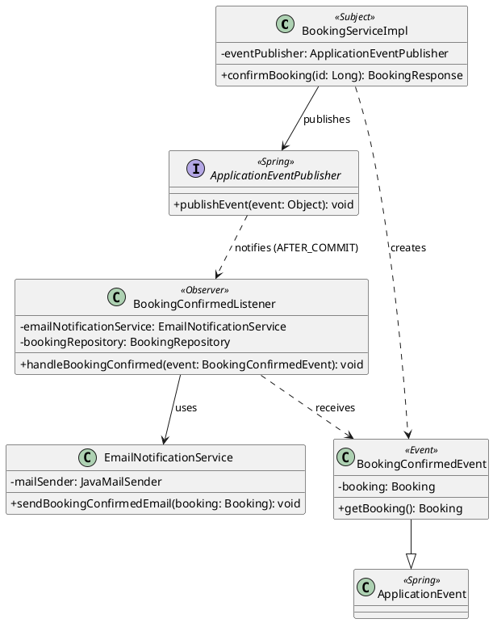

# Design Patterns

## สรุป

| Pattern | กลุ่ม | ปัญหาที่แก้ | ไฟล์ / คลาสหลัก | ผู้รับผิดชอบ |
|---|---|---|---|---|
| State | GoF Behavioral | _(กิตติญาดา)_ | `state/` | กิตติญาดา |
| Strategy | GoF Behavioral | _(นาเดีย)_ | `pricing/` | นาเดีย |
| Observer | GoF Behavioral | แยกการแจ้งเตือนลูกค้าออกจาก logic ยืนยันการจอง และส่งอีเมลเฉพาะเมื่อบันทึกสำเร็จจริง | `notification/` | กิตติรัช |
| Layered / MVC / Repository / Service Layer / DTO + Mapper / DI | Enterprise | _(เติมภายหลัง)_ | ทั้งโปรเจกต์ | ทั้งทีม |

---

## Observer Pattern

### ปัญหาที่แก้

เมื่อพนักงานยืนยันการจอง ระบบต้องแจ้งลูกค้าทางอีเมล ถ้าเขียนการส่งอีเมลไว้ใน `BookingServiceImpl.confirmBooking()` โดยตรง จะเกิดปัญหา 3 ข้อ

1. **ผูกติดกัน (tight coupling)** `BookingServiceImpl` ต้องรู้จักระบบอีเมล ถ้าวันหลังอยากเพิ่ม SMS หรือ LINE ต้องกลับไปแก้ service การจอง ซึ่งผิดหลัก Open/Closed
2. **ส่งอีเมลก่อนบันทึกจริง** ถ้าส่งอีเมลระหว่าง transaction แล้วการบันทึกล้มเหลวทีหลัง ลูกค้าจะได้อีเมลยืนยันการจองที่ไม่ได้ถูกยืนยันจริง
3. **อีเมลล้มทำให้การยืนยันล้ม** ถ้า SMTP ใช้งานไม่ได้ ไม่ควรทำให้การยืนยันการจองล้มเหลวไปด้วย

### วิธีแก้ด้วย Observer

`BookingServiceImpl` (Subject) แค่**ประกาศเหตุการณ์** `BookingConfirmedEvent` ผ่าน `ApplicationEventPublisher` ของ Spring โดยไม่รู้ว่าใครรับฟังอยู่ ส่วน `BookingConfirmedListener` (Observer) รับเหตุการณ์แล้วสั่ง `EmailNotificationService` ส่งอีเมล

| บทบาทใน Pattern | คลาสในระบบ | ไฟล์ |
|---|---|---|
| Subject (ผู้ประกาศ) | `BookingServiceImpl.confirmBooking()` ผ่าน `ApplicationEventPublisher` | `service/impl/BookingServiceImpl.java` |
| Event (ข้อมูลที่ส่ง) | `BookingConfirmedEvent extends ApplicationEvent` | `notification/BookingConfirmedEvent.java` |
| Observer (ผู้รับฟัง) | `BookingConfirmedListener` | `notification/BookingConfirmedListener.java` |
| ผู้ทำงานจริง | `EmailNotificationService` ใช้ `JavaMailSender` | `notification/EmailNotificationService.java` |

### รายละเอียดที่ออกแบบไว้

- **`@TransactionalEventListener(phase = AFTER_COMMIT)`** Listener ทำงานหลังบันทึกสถานะ `CONFIRMED` ลงฐานข้อมูลสำเร็จแล้วเท่านั้น ถ้า transaction ถูก rollback จะไม่ส่งอีเมล (แก้ปัญหาข้อ 2)
- **`@Transactional(propagation = REQUIRES_NEW, readOnly = true)`** Listener เปิด transaction ใหม่แบบอ่านอย่างเดียว เพื่อโหลดข้อมูลการจอง (ลูกค้า ห้อง วันที่ ราคา) จากฐานข้อมูลอีกครั้ง เพราะ transaction เดิมปิดไปแล้ว
- **จับ `MailException` / `MessagingException`** ส่งอีเมลไม่สำเร็จจะบันทึก log แต่การจองยังเป็น `CONFIRMED` (แก้ปัญหาข้อ 3)
- **เพิ่มช่องทางแจ้งเตือนใหม่ได้โดยไม่แก้โค้ดเดิม** เช่นเพิ่ม `SmsNotificationListener` ที่รับ `BookingConfirmedEvent` เหมือนกัน `BookingServiceImpl` ไม่ต้องแก้แม้แต่บรรทัดเดียว (แก้ปัญหาข้อ 1)

### Class Diagram

### ลำดับการทำงาน

1. พนักงานกดยืนยันการจอง → `BookingServiceImpl.confirmBooking()` เปลี่ยนสถานะผ่าน State Pattern แล้วบันทึก
2. `eventPublisher.publishEvent(new BookingConfirmedEvent(this, savedBooking))`
3. transaction commit สำเร็จ → Spring เรียก `BookingConfirmedListener.handleBookingConfirmed()`
4. Listener โหลดการจองใหม่ด้วย `bookingRepository.findById()`
5. `EmailNotificationService.sendBookingConfirmedEmail()` สร้างอีเมล HTML แล้วส่งผ่าน `JavaMailSender`

ทดสอบได้จริงด้วย Docker: อีเมลจะไปแสดงที่ Mailpit `http://localhost:8025`