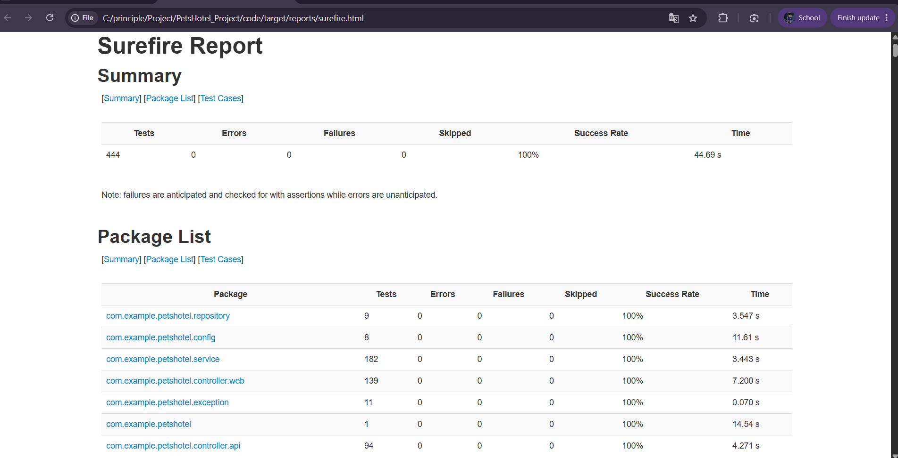
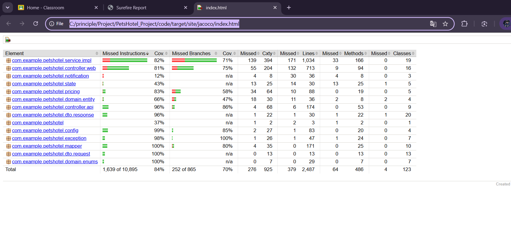

# Test Report

ผลการทดสอบระบบ PetsHotel โค้ดทดสอบอยู่ใน `code/src/test/java` ส่วนโฟลเดอร์นี้เก็บรายงานผลที่สร้างจากการรัน test

## สรุปผล

| รายการ | ผล |
|---|---:|
| Test class | 42 |
| Tests ทั้งหมด | 444 |
| ผ่าน | 444 |
| Failures / Errors / Skipped | 0 / 0 / 0 |
| Line coverage | 84.8% |
| Branch coverage | 70.9% |

## ประเภทการทดสอบ

| ประเภท | Class | Tests |
|---|---:|---:|
| Service | 15 | 182 |
| REST Controller | 8 | 94 |
| Web Controller | 13 | 139 |
| Repository | 2 | 9 |
| Config / Security | 2 | 8 |
| Exception Handler | 1 | 11 |
| Application context | 1 | 1 |

## รายงานฉบับเต็ม

- [ผลทดสอบรายตัว](test-report/surefire.html)
- [Coverage รายไฟล์และรายบรรทัด](coverage-report/index.html)

GitHub แสดงไฟล์ HTML เป็นโค้ด หากต้องการดูเป็นหน้าเว็บ ให้ดาวน์โหลด repository แล้วเปิดไฟล์ใน browser





## วิธีสร้างรายงานใหม่

ต้องมี Java 26, PostgreSQL และฐานข้อมูล `pethotel_test` จาก PowerShell ให้เข้าโฟลเดอร์ `code` แล้วรัน:

```powershell
$env:TEST_DB_PASSWORD = '<รหัสผ่าน PostgreSQL>'
.\mvnw.cmd clean test
.\mvnw.cmd org.apache.maven.plugins:maven-surefire-report-plugin:3.5.6:report-only
```

เมื่อโค้ดหรือ test เปลี่ยน ต้องสร้างรายงานใหม่และอัปเดตตัวเลขในหน้านี้

_ผลนี้รันกับซอร์สที่ HEAD `3ce3b41` และ JaCoCo 0.8.15_